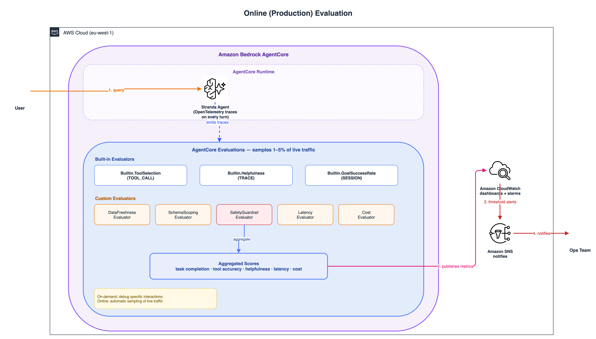

# agentic-evaluation

[](https://opensource.org/licenses/MIT-0)
[](https://www.python.org/downloads/)
[](https://aws.amazon.com/cdk/)

> **Note:** AWS code samples are example code that demonstrates practical implementations of AWS services for specific use cases and scenarios.
>
> These application solutions are not supported products in their own right, but educational examples to help our customers use our products for their applications. As our customer, any applications you integrate these examples into should be thoroughly tested, secured, and optimized according to your business's security standards & policies before deploying to production or handling production workloads.
>
> Before any real-world use, review the security controls in [docs/SECURITY.md](docs/SECURITY.md) and the [Production security recommendations](#production-security-recommendations) below, and adapt the code to your own requirements.

A framework-agnostic software development kit (SDK) for evaluating artificial intelligence (AI) agents. It supports Strands Agents, Amazon Bedrock AgentCore, LangChain, CrewAI, and OpenAI. The SDK also works with custom HTTP endpoints and most agents that can be wrapped in a callable.
Run a 3-layer evaluation (tool usage, reasoning, output quality) plus a
domain-specific layer for safety, scoping, latency, and cost.

This repository also contains a **reference deployment** on AWS using Strands +
Amazon Bedrock AgentCore (a car-auction marketplace dealer stock-search agent). See the
[Reference deployment](#reference-deployment-car-auction-dealer-search) section following.

## Prerequisites

- Python 3.14+
- [uv](https://docs.astral.sh/uv/) package manager (v0.4+)
- Git (to clone the repository)

Install uv: `curl -LsSf https://astral.sh/uv/install.sh | sh`

> **Note:** The no-AWS demo (`quickstart/run_demo.py`) does not require AWS credentials or Amazon Bedrock access.

## SDK quickstart (no AWS, <60s)

```bash
git clone https://github.com/aws-samples/evaluating-agents-on-aws-with-strands-and-agentcore.git
cd evaluating-agents-on-aws-with-strands-and-agentcore
uv sync
uv run python quickstart/run_demo.py
```

You'll see Layer 1 (tool usage), Layer 2/3 (judge defaults to no-op so the
demo needs no LLM), and the domain layer evaluate a mock agent in seconds.

## Use it for *your* agent

```python
from agentic_evaluation import run_all_layers, TaskFnResult

def task_fn(case) -> TaskFnResult:
    # Replace with your agent: Strands, AgentCore, LangChain, OpenAI, ...
    return {
        "output": "the answer",
        "trajectory": ["search", "answer"],
        "metadata": {"latency_ms": 420},  # milliseconds; read by LatencyEvaluator
    }

results = run_all_layers(task_fn=task_fn)
print("All passed:", results["all_passed"])
```

Or via the CLI:

```bash
agentic-eval init --name my-agent --tools "search,answer"
agentic-eval validate --config eval_config.yaml
agentic-eval run --config eval_config.yaml --task-fn my_pkg.tasks:run
```

Your agent endpoint should accept POST `{"query": "..."}` and return `{"output", "trajectory", "metadata"}`; see [docs/SDK_GUIDE.md](docs/SDK_GUIDE.md) for framework adapters.

For per-framework recipes (Strands, Amazon Bedrock AgentCore, LangChain, CrewAI, OpenAI, HTTP)
see [docs/SDK_GUIDE.md](docs/SDK_GUIDE.md).

---

## Reference deployment: car-auction dealer search

The rest of this repo is a complete reference implementation of the SDK
on AWS with Strands and Amazon Bedrock AgentCore. The deployment-specific docs are in the following sections.

This repository accompanies the AWS blog post: **[Evaluating production AI agents on AWS with Strands and AgentCore](https://aws.amazon.com/blogs/machine-learning/evaluating-production-ai-agents-on-aws-with-strands-and-agentcore/)**. The blog post provides conceptual understanding, architecture patterns, and key decision points. This repository provides a complete reference implementation of those patterns. Read the blog post first for context, then return here to explore the code.

## What You'll Build

A complete evaluation pipeline for AI agents that:

- **Catches issues before deployment** with build-time *offline* evaluation (strands-agents-evals)
- **Monitors production behavior** with continuous *online* evaluation by sampling live traffic (Amazon Bedrock AgentCore Evaluations)
- **Integrates with CI/CD** as quality gates blocking bad deploys
- **Provides observability** through OpenTelemetry instrumentation
- **Demonstrates patterns for scaling** that were tested with 1,500+ concurrent users

**Use Case**: Based on a real-world car auction marketplace dealer stock search agent. This conversational AI searches 1,500-2,500 vehicles daily across dozens of vehicle attributes. It uses natural language queries, hybrid search with LanceDB, and Amazon Bedrock models. LanceDB is a vector database for storing and searching embeddings, the numerical vector representations of text.

**Estimated Cost**: $50-100/month for dev/test environments (varies by evaluation frequency and sampling rate).

## Architecture

The diagrams below are rendered from editable source in [`docs/diagrams/`](docs/diagrams/) (draw.io `.drawio` files, one per PNG). Open a `.drawio` file at [app.diagrams.net](https://app.diagrams.net) to edit, then re-export the matching PNG in `docs/images/`.

### Data Ingestion Pipeline


Daily automated refresh of vehicle inventory:
- **Amazon EventBridge**: Scheduled daily trigger before auction starts
- **AWS Lambda**: Ingestion function that reads vehicle data from the source (BigQuery is mocked in this sample — it reads sample data from Amazon S3)
- **Amazon Nova Lite v1**: Text contextualization for semantic search
- **Amazon Titan Text Embeddings V2**: 1,024-dimension vector generation
- **Amazon S3**: Persistent storage for the LanceDB dataset, loaded into an in-memory LanceDB by the AgentCore Runtime at cold start

### Agent Runtime Architecture


AgentCore Runtime orchestrates **8 tools** (see `examples/vehicle-auction-agent/agent/app.py`):
- **Search & retrieval**: `search_vehicles` (structured filters), `run_sql` (validated pandas query), `hybrid_search` (semantic), `filter_by_distance` (geo)
- **Supporting**: `get_schema`, `get_embedding`, `get_bids`, `get_dealer_profile` (Amazon DynamoDB lookup)
- **Claude Sonnet 4.6 from Anthropic (available through Amazon Bedrock)**: Reasoning and orchestration
- **LanceDB**: Dual-layer architecture (Amazon S3 persistence + in-memory performance)

### Three-Layer Evaluation Framework


Build-time (offline) evaluation across three layers. Each layer maps onto the
vocabulary used by the wider evaluation landscape (DeepEval, Ragas, Anthropic),
so the concepts transfer if you already use another tool:

1. **Tool Usage (>95% threshold)**: correct tool selection and parameter validation.
   *Standard term:* **tool correctness / tool-call accuracy** (DeepEval `ToolCorrectnessMetric`, Ragas `ToolCallAccuracy`).
2. **Reasoning (>85% threshold)**: coherent decision-making scored by an LLM judge over the trajectory.
   *Standard term:* **process evaluation** (judging *how* the agent decided).
3. **Output Quality (>90% threshold)**: helpful, accurate, actionable final responses.
   *Standard term:* **outcome evaluation / goal success** (Ragas `AgentGoalAccuracy`, DeepEval `TaskCompletion`).

All three layers must pass before deployment proceeds.

> **Terminology note.** The layer names in the following table are canonical (they match the
> accompanying blog post). The SDK also accepts and emits the standard aliases:
> `run_all_layers()` results are keyed by both `layer_1`/`layer_2`/`layer_3`/`domain`
> *and* `tool_correctness`/`process_evaluation`/`outcome_evaluation`/`operational_metrics`
> (the alias points at the same object). `eval_config.yaml` accepts either name in
> `evaluation_layers`.

### How each layer runs at build time (offline) vs. in production (online)

The same evaluation *concepts* run in two places, with different mechanics. The
field calls these **offline evaluation** and **online evaluation** (the terms
used by LangSmith, Braintrust, and Anthropic), which this project also describes
as "build time" and "production":

- **Offline / build time** is the SDK (`run_all_layers`) running in CI against a
  fixed set of curated test cases with ground-truth expectations, a hard gate
  that blocks the deploy.
- **Online / production** is Amazon Bedrock AgentCore Evaluations, an AWS-managed service that
  samples a small fraction of *real* live traffic and scores it continuously,
  alerting instead of blocking.

The following table compares how each evaluation layer runs in two contexts: offline during build time (SDK in CI) versus online in production (Amazon Bedrock AgentCore). Each of the four layers (Tool Usage, Reasoning, Output Quality, and Domain) uses different mechanics depending on the context.

| Layer | Offline: build time (SDK, CI gate) | Online: production (Amazon Bedrock AgentCore, continuous) |
|-------|---------------------------|------------------------------------|
| Layer 1: Tool Usage | `ToolSelectionGrader` + `TrajectoryOrderGrader` (deterministic, no LLM) compare each test case's trajectory to its `expected_tools`. Fast, runs on every commit. | `Builtin.ToolSelection` scores tool choice on sampled live sessions. |
| Layer 2: Reasoning | `HelpfulnessEvaluator` + `TrajectoryEvaluator` (LLM-as-judge) score decision quality against a rubric. Needs Amazon Bedrock access. | `Builtin.Helpfulness` on sampled traffic. |
| Layer 3: Output Quality | `OutputEvaluator` + `GoalSuccessRateEvaluator` (LLM-as-judge) score the final answer. | `Builtin.GoalSuccessRate` on sampled traffic. |
| Domain | Deterministic evaluators (latency, cost, safety, freshness, scoping) read each case's `metadata`. No LLM. | Custom evaluators on real telemetry (Amazon CloudWatch latency/cost, guardrail hits). |

**Key differences:**
- **Coverage**: build time runs *every* curated test case; production samples 1–5% of live traffic.
- **Failure action**: build time **blocks the deploy** (`results["all_passed"]` is the gate); production **alerts** (Amazon SNS / CloudWatch) without blocking users.
- **Data**: build time uses fixed expected trajectories/outputs; production has no ground truth, so it leans on LLM judges and deterministic telemetry checks.
- **Feedback loop**: a production failure becomes a new build-time test case (see [Production feedback loop](docs/EVALUATION_GUIDE.md#production-feedback-loop)), so the gate gets stricter over time.

### Production Evaluation Architecture



Amazon Bedrock AgentCore Evaluations provides continuous production monitoring with built-in and custom evaluators, sampling 1-5% of live traffic.

### Six-Stage Deployment Pipeline


1. **Unit Tests and Lint**: Code quality baseline
2. **Tool Correctness**: ToolSelectionGrader and TrajectoryOrderGrader verify selection and ordering
3. **Trajectory Tests**: Multi-step workflow validation
4. **LLM-as-Judge**: OutputEvaluator, HelpfulnessEvaluator, GoalSuccessRateEvaluator score quality
5. **Staging Validation**: On-demand Amazon Bedrock AgentCore evaluation against staging data
6. **Online Evaluation**: Continuous production sampling post-deployment

## Prerequisites

- **AWS Account** with access to Amazon Bedrock and Amazon Bedrock AgentCore
- **AWS CDK** v2.100+ installed and bootstrapped: `npm install -g aws-cdk`
- **Python 3.14+**: Check with `python --version`
- **[uv](https://docs.astral.sh/uv/) package manager (v0.4+)**: `curl -LsSf https://astral.sh/uv/install.sh | sh`
- **GitLab account** (for CI/CD pipeline)
- **Amazon Bedrock model access**: Request access to the following foundation models in Amazon Bedrock:
  - Amazon Titan Text Embeddings V2
  - Amazon Nova Lite v1
  - Claude Sonnet 4.6 from Anthropic (available through Amazon Bedrock)

### AWS Service Quotas

Verify that you have sufficient quotas for:
- Amazon Bedrock: Claude Sonnet 4.6 (50,000 TPM minimum)
- AWS Lambda: 1,000 concurrent executions
- Amazon S3: No specific quota concerns
- Amazon EventBridge: 300 rules (well under default limits)

## Quick Start

### 1. Clone and Set Up Environment

Clone the repository:

```bash
git clone https://github.com/aws-samples/evaluating-agents-on-aws-with-strands-and-agentcore.git
cd evaluating-agents-on-aws-with-strands-and-agentcore
```

Install dependencies with uv:

```bash
uv sync
```

Activate the virtual environment:

```bash
source .venv/bin/activate
```

### 2. Configure AWS Credentials

```bash
aws configure
```

### 3. Verify Amazon Bedrock Access

```bash
aws bedrock list-foundation-models --region eu-west-1
```

### 4. Deploy CDK Infrastructure

Bootstrap the CDK environment. Skip this step if you have already bootstrapped this account and region:

```bash
cdk bootstrap aws://ACCOUNT-ID/REGION
```

Change to the CDK directory:

```bash
cd examples/vehicle-auction-agent/cdk
```

Deploy the stack:

```bash
uv run cdk deploy --all --require-approval never
```

Note the outputs (AgentCore Runtime endpoint, S3 bucket name, etc.).

### 5. Run Build-Time Quality Checks

```bash
# Run all tests (excluding deployed infrastructure tests)
uv run pytest tests/ -m "not deployed" -v

# Run unit tests only (fast, no AWS/LLM calls)
uv run pytest tests/unit/ -v

# Run full evaluation pipeline with LLM judges (requires Amazon Bedrock access)
uv run pytest tests/integration/test_full_evaluation.py -v

# Run deployed infrastructure tests (requires deployed CDK stacks)
uv run pytest tests/ -m deployed -v
```

All tests should pass with no failures. A successful run produces output similar to:

```
===== X passed in Y.YYs =====
```

If any tests fail, review the error output and confirm your AWS credentials and Amazon Bedrock model access are configured correctly.

After completing these steps, you have deployed the agent evaluation infrastructure and verified it works correctly. You can now configure production monitoring or customize the evaluation pipeline for your use case.

### 6. Configure Production Monitoring

To enable Amazon Bedrock AgentCore Online Evaluation, use the AWS Console or CLI:

```bash
aws bedrock-agentcore create-evaluation-config \
  --agent-id YOUR_AGENT_ID \
  --sampling-rate 0.03 \
  --evaluators Builtin.Helpfulness Builtin.GoalSuccessRate Builtin.ToolSelection
```

## Repository Structure

```
.
├── README.md                          # This file
├── CONTRIBUTING.md                    # Contribution guidelines
├── LICENSE                            # MIT-0 License
├── pyproject.toml                     # uv package configuration
├── eval_config.yaml                   # Evaluation config (tools, rubrics, thresholds, test cases)
├── .gitignore                         # Git ignore patterns
├── .gitlab-ci.yml                     # GitLab CI/CD pipeline
│
├── docs/                              # Documentation
│   ├── EVALUATION_GUIDE.md     # Reference guide for using this framework
│   ├── SECURITY.md                    # Security best practices
│   ├── TROUBLESHOOTING.md             # Common issues and fixes
│   ├── PERFORMANCE.md                 # Performance tuning guide
│   └── images/                        # Architecture diagrams (PNG)
│
├── src/agentic_evaluation/            # THE PRODUCT: evaluation SDK (the agentic-evaluation wheel)
│   ├── __init__.py
│   ├── config.py                      # YAML config loader
│   ├── evaluators.py                  # strands-evals Evaluator subclasses
│   ├── judges.py                      # Pluggable LLM judge backends
│   ├── generate_cases.py              # Test-case generator helpers
│   ├── run_experiment.py              # Experiment builders + run_all_layers()
│   ├── test_cases.py                  # TestCase, TestCaseRegistry
│   ├── thresholds.py                  # EvaluationThresholds dataclass
│   ├── adapters/                      # strands_local / agentcore / http task_fns
│   └── examples/                      # Reusable evaluator presets
│
├── examples/vehicle-auction-agent/    # THE EXAMPLE: reference agent the SDK is tested against
│   ├── agent/                         # Agent code (AgentCore Runtime)
│   │   ├── app.py                     # Strands agent with 8 tools
│   │   ├── requirements.txt           # Agent dependencies
│   │   └── utils/geo.py               # Haversine + bounding box
│   ├── cdk/                           # AWS CDK infrastructure (Python)
│   │   ├── app.py                     # CDK app entry point
│   │   └── lib/
│   │       ├── data_pipeline_stack.py # EventBridge + Lambda + S3
│   │       ├── agent_runtime_stack.py # AgentCore Runtime (L2 construct)
│   │       ├── dealer_api_stack.py    # DynamoDB + API Gateway
│   │       ├── evaluation_stack.py    # CloudWatch + SNS + IAM
│   │       └── monitoring_stack.py    # Dashboards and alarms
│   └── lambda/functions/              # Lambda functions
│       ├── data_ingestion/            # BigQuery to S3 pipeline
│       └── dealer_api/                # Dealer profile API
│
├── tests/                             # Test suites
│   ├── conftest.py                    # Pytest fixtures
│   ├── sdk/                           # SDK-only tests (no AWS, no LLM)
│   │   ├── unit/                      # cli, judges, plugins, layer gating, scoping
│   │   └── integration/              # quickstart end-to-end
│   ├── unit/
│   │   ├── test_advanced_tools.py     # Example-agent tool tests
│   │   └── test_thresholds.py         # Threshold config tests
│   └── integration/                   # Live/deployed tests (require AWS)
│       ├── test_full_evaluation.py    # Build-time gate with LLM judges
│       ├── test_real_agent_eval.py    # Full pipeline against the live agent
│       ├── test_deployed_stack.py     # Post-deployment checks
│       └── test_e2e_smoke.py          # E2E smoke tests
│
└── scripts/                           # Deploy + data helpers for the example
    ├── deploy_stack.py                # Build image (CodeBuild) then cdk deploy
    ├── deploy_codebuild.py            # Build the agent image in CodeBuild
    ├── post_deploy_eval.py            # Smoke-eval a deployed runtime
    ├── seed_dealer_data.py            # Seed dealer profiles into DynamoDB
    └── validate_deployment.py         # Post-deployment health check
```

> New project? Scaffold a config with `agentic-eval init` (see the preceding SDK quickstart section).

## Testing Approaches

### Run all assessment layers

```python
from agentic_evaluation import run_all_layers

def agent_task(case):
    # Replace with your real agent call
    return {"output": "response", "trajectory": ["tool_a"], "metadata": {}}

results = run_all_layers(task_fn=agent_task)
print(f"All passed: {results['all_passed']}")
# Layers: layer_1 (tool usage), layer_2 (reasoning), layer_3 (output quality), domain
```

### Config-driven evaluation

```python
from agentic_evaluation import load_config, run_all_layers, TestCaseRegistry

cfg = load_config("eval_config.yaml")
registry = TestCaseRegistry.from_config(cfg.test_cases)
results = run_all_layers(task_fn=agent_task, registry=registry)
```

### Multi-trial for production reliability

```python
results = run_all_layers(task_fn=agent_task, num_trials=5)
# Gate on pass^k: all trials must pass
for layer in ["layer_1", "layer_2", "layer_3", "domain"]:
    info = results[layer]
    print(f"{layer}: pass@5={info['pass_at_k']}, pass^5={info['pass_all_k']}")
```

### Scaffold a new project

```bash
agentic-eval init --name "my-agent" --tools "search,analyze"
# Creates eval_config.yaml and a task-function stub
```

See [docs/EVALUATION_GUIDE.md](docs/EVALUATION_GUIDE.md) for the complete API reference and usage patterns.

## Security

This implementation follows AWS security recommended practices:

- **Avoids hardcoded secrets**: Uses AWS Secrets Manager and IAM roles
- **Least privilege IAM**: Granular permissions for each component
- **Encryption at rest**: S3 buckets use SSE-S3 or SSE-KMS
- **Encryption in transit**: Amazon Bedrock API TLS 1.2+ for all API calls
- **VPC isolation**: AgentCore Runtime in private subnets
- **Security scanning**: Bandit, pip-audit, safety, detect-secrets, cfn-nag in CI/CD

See [docs/SECURITY.md](docs/SECURITY.md) for complete security implementation.

## Troubleshooting

Common issues and solutions:

| Issue | Cause | Solution |
|-------|-------|----------|
| Evaluation timeouts | Lambda configured with 3-minute timeout | Increase Lambda timeout to 10 minutes |
| Embedding dimension mismatch | Using Amazon Titan v1 instead of v2 | Verify `amazon.titan-embed-text-v2:0` model |
| Shadow mode degradation | Data drift or index loading issues | Check CloudWatch logs for pipeline failures |
| High evaluation costs | Sampling rate too high | Start with 1-3% sampling, increase gradually |
| CDK deployment failures | Missing Amazon Bedrock model access | Request model access in AWS Console |

See [docs/TROUBLESHOOTING.md](docs/TROUBLESHOOTING.md) for 20+ detailed troubleshooting scenarios with CloudWatch Insights queries and debug commands.

## Performance

**Latency Targets** (design targets under typical conditions):
- Response latency P50: <2s
- Response latency P99: <10s
- Tool selection: <50ms
- Semantic search (LanceDB): <100ms

**Throughput:**
- Designed to support up to 1,500+ concurrent users under typical conditions
- Can handle up to 50,000+ daily queries in testing
- Typically processes 1,500-2,500 vehicles per auction cycle

**Cost Optimization:**
- LanceDB in-memory: Can reduce S3 direct query latency (typically from 100-200ms to sub-millisecond in testing)
- Blue-green deployment: Designed for zero-downtime data refresh
- Evaluation sampling: 1-5% production traffic (adjustable)

See [docs/PERFORMANCE.md](docs/PERFORMANCE.md) for benchmarking methodology and tuning parameters.

## Cost Estimate

**Cost:** This sample uses AWS services. For pricing details, see the pricing page for each service. To avoid ongoing charges, delete the resources when you finish testing (see [Cleaning Up](#cleaning-up)).

Illustrative monthly costs at a production-scale workload (1,500 concurrent users, 50K daily queries):

| Component | Monthly Cost (USD) |
|-----------|-------------------|
| Claude Sonnet 4.6 from Anthropic (via Amazon Bedrock) | $600-900 |
| Amazon Titan Text Embeddings V2 | $100-150 |
| Amazon Nova Lite v1 | $50-75 |
| AWS Lambda (data pipeline) | $50-75 |
| Amazon S3 (LanceDB storage) | $20-30 |
| Amazon EventBridge | $5-10 |
| CloudWatch Logs & Metrics | $50-100 |
| **Total** | **$875-1,340** |

**Dev/Test Environment**: $50-100/month (minimal traffic, shorter log retention)

## Cleaning Up

**Important:** You are responsible for the cost of AWS services used while running this sample. There is no additional cost for using this sample. For full details, see the pricing pages for each AWS service used.

To avoid ongoing charges, delete all deployed resources:

> **Important:** The following commands delete AWS resources and their data. If you need to preserve any data, create a backup before running them.

Change to the CDK directory:

```bash
cd examples/vehicle-auction-agent/cdk
```

Destroy the CDK stacks:

```bash
uv run cdk destroy --all
```

> **Note:** In production (`ENVIRONMENT=prod`), DynamoDB tables use `RemovalPolicy.RETAIN` and survive `cdk destroy`. Before manual deletion, create a backup with:
> ```bash
> aws dynamodb create-backup --table-name agent-eval-dealers-prod --backup-name dealers-final-$(date +%Y%m%d)
> ```

Verify DynamoDB tables are removed (deleted by `cdk destroy`):

```bash
aws dynamodb list-tables --region eu-west-1 | grep agent-eval
```

Delete Amazon Bedrock AgentCore evaluation configs (via AWS Console or CLI):

```bash
aws bedrock-agentcore delete-evaluation-config --config-id YOUR_CONFIG_ID
```

To delete S3 buckets, first back up any needed data, then empty and remove them:

```bash
# List bucket contents first:
aws s3 ls s3://amzn-s3-demo-bucket --recursive
# To preserve data, download it first:
aws s3 sync s3://amzn-s3-demo-bucket ./backup/
# Then empty and delete the bucket:
aws s3 rb s3://amzn-s3-demo-bucket --force
```

Delete Amazon ECR repositories (`--force` also deletes all container images):

```bash
aws ecr delete-repository --repository-name agent-eval-runtime-dev --region eu-west-1 --force
```

Delete the AWS CodeBuild project (created by `deploy_codebuild.py`):

```bash
aws codebuild delete-project --name agent-eval-runtime-build-dev --region eu-west-1
```

Delete the Amazon SQS dead-letter queue (created by the data pipeline stack):

```bash
aws sqs delete-queue --queue-url "$(aws sqs get-queue-url --queue-name agent-eval-ingestion-dlq-dev --region eu-west-1 --query 'QueueUrl' --output text)" --region eu-west-1

# Delete SNS topic (created by the evaluation stack)
aws sns delete-topic --topic-arn "arn:aws:sns:eu-west-1:ACCOUNT_ID:agent-eval-alerts-dev" --region eu-west-1

# Delete CloudWatch log groups (if not auto-deleted)
aws logs delete-log-group --log-group-name /aws/lambda/agent-eval-data-ingestion-dev --region eu-west-1
aws logs delete-log-group --log-group-name /aws/lambda/agent-eval-runtime-dev --region eu-west-1

# Delete API Gateway REST API
aws apigateway get-rest-apis --query 'items[?name==`agent-eval-dealer-api-dev`].id' --output text --region eu-west-1 | xargs -I {} aws apigateway delete-rest-api --rest-api-id {} --region eu-west-1

# Step 1: remove the rule's targets
aws events remove-targets --rule agent-eval-daily-refresh-dev --ids 1 --region eu-west-1
# Step 2: delete the rule
aws events delete-rule --name agent-eval-daily-refresh-dev --region eu-west-1

# Delete CloudWatch dashboard and alarms
aws cloudwatch delete-dashboards --dashboard-names agent-eval-dev --region eu-west-1
```

> **Note:** In production (`ENVIRONMENT=prod`), some resources use `RemovalPolicy.RETAIN` and survive `cdk destroy` (S3 buckets, DynamoDB tables, CloudWatch Log Groups). Delete them manually if you no longer need them.

```bash
# Verify cleanup
aws cloudformation list-stacks --stack-status-filter DELETE_COMPLETE --region eu-west-1
aws s3 ls | grep agent-eval
aws logs describe-log-groups --log-group-name-prefix /aws/lambda/agent-eval --region eu-west-1
aws dynamodb list-tables --region eu-west-1 | grep agent-eval
aws ecr describe-repositories --region eu-west-1 | grep agent-eval
aws sns list-topics --region eu-west-1 | grep agent-eval
aws apigateway get-rest-apis --region eu-west-1 --query 'items[?contains(name,`agent-eval`)].name'
```

## Contributing

Contributions are welcome! To contribute, see [CONTRIBUTING.md](CONTRIBUTING.md) for guidelines.

**Key areas for contribution:**
- Additional custom evaluators (compliance, cost, latency)
- Multi-region deployment patterns
- Alternative data sources (Snowflake, Redshift, DynamoDB)
- Enhanced monitoring dashboards
- Performance benchmarking scripts

## Resources

### Documentation
- [Strands Agents SDK](https://strandsagents.com/)
- [strands-agents-evals GitHub](https://github.com/strands-agents/evals)
- [Amazon Bedrock AgentCore](https://docs.aws.amazon.com/bedrock-agentcore/latest/devguide/what-is-bedrock-agentcore.html)
- [Amazon Bedrock AgentCore Evaluations](https://docs.aws.amazon.com/bedrock-agentcore/latest/devguide/evaluations.html)
- [AgentCore Observability](https://docs.aws.amazon.com/bedrock-agentcore/latest/devguide/observability.html)
- [AgentCore Starter Toolkit](https://aws.github.io/bedrock-agentcore-starter-toolkit/)

### Blog Posts
- [Evaluating production AI agents on AWS with Strands and AgentCore](https://aws.amazon.com/blogs/machine-learning/evaluating-production-ai-agents-on-aws-with-strands-and-agentcore/)
- [Operationalize generative AI workloads with Amazon Bedrock, Part 1: GenAIOps](https://aws.amazon.com/blogs/machine-learning/operationalize-generative-ai-workloads-and-scale-to-hundreds-of-use-cases-with-amazon-bedrock-part-1-genaiops/)

## Production security recommendations

This repository is an educational AWS sample. The reference deployment already
implements several controls (AWS WAF with rate-based rules, API Gateway usage-plan
throttling and quotas, Amazon Bedrock Guardrails, KMS encryption, least-privilege
IAM with confused-deputy guards, and ECR scan-on-push). Before using this code for
production or any real workload, we recommend the additional hardening below. These
map to the P1 ("fix before production deployment") findings from our security review.

### Agent endpoint
- **Amazon Bedrock Guardrails** — keep them enabled and fail-closed. The sample
  configures denied topics (bid placement/outcome), a HIGH prompt-attack content
  filter, and PII redaction (EMAIL, PHONE). For production, also add output-side
  topic avoidance so the agent refuses to describe its own tools, prompts, or
  internal reasoning, and extend PII entities to match your data.
- **AWS WAF + API Gateway** — keep WAF rate-based rules and API Gateway
  rate-limiting/quotas in front of every public endpoint. Note that WAF cannot front
  the AgentCore Runtime data-plane directly; gate browser/API traffic through
  CloudFront or API Gateway.
- **Authentication** — require authenticated access (Amazon Cognito JWT or IAM
  SigV4) on the agent endpoint; do not expose it anonymously. Bind the dealer/tenant
  identity to the verified principal (a Cognito/JWT claim) rather than trusting a
  caller-supplied `dealer_id` in the request body.

### Secrets and supply chain
- **Secrets management** — when wiring a real data source (the sample mocks
  BigQuery via `MOCK_BIGQUERY=true`), store any GCP or third-party credentials in
  **AWS Secrets Manager** with automatic rotation and least-privilege IAM
  conditions. Do not embed credentials in code or environment variables.
- **Container image integrity** — ECR scan-on-push is enabled in the sample. For
  production, add image scanning in CI (e.g. Trivy) and consider **AWS Signer** for
  container image signing with verification at runtime pull.

### Anti-scraping / model-behavior extraction (threat T9)
A determined caller can send many structured queries to reverse-engineer the
agent's tools, ranking logic, and prompts ("model scraping" / "prompt extraction").
The API Gateway throughput limit alone does not distinguish heavy legitimate use
from adversarial probing. For production, layer on:

1. **Per-identity rate limiting (highest priority)** — enforce per-API-key or
   per-Cognito-user quotas (e.g. 50 req/min, 500 req/hour) via API Gateway usage
   plans with per-key caps, or a DynamoDB-backed counter in a Lambda authorizer.
2. **Probing-pattern detection** — log query sequences per identity and alert/block
   on high volume + low result diversity (single-parameter sweeps, sequential ID
   probing, identical queries from rotating IPs).
3. **Response minimization** — in production responses, strip internal metadata
   (selected tool names, embedding similarity scores, the SQL/`where_clause`, and the
   full trajectory) and return only the final answer. **Note:** the agent currently
   returns `trajectory` and `available_tools` because the build-time evaluation SDK
   needs them to score tool selection and reasoning. Gate this behind an
   environment flag so evaluation builds keep the full trajectory while production
   responses are minimized.
4. **Output-side Guardrails** — configure topic avoidance so the agent refuses to
   explain its own architecture, tools, or prompts.
5. **Authentication requirement** — require API key or Cognito token to eliminate
   anonymous bulk scraping, and tie rate limits to verified dealer identities.

The cheapest immediate step is adding per-API-key usage-plan quotas (the API
Gateway config already has throttling) combined with stripping tool/trajectory
metadata from production responses.

## License

This library is licensed under the MIT-0 License. See the [LICENSE](LICENSE) file for details.

## Authors

- **Amit Deol** - Senior Prototyping Architect, AWS Prototyping and Cloud Engineering (PACE)
- **Hin Yee Liu** - Senior Prototype Engagement Manager, AWS

## Acknowledgments

- The industry partner for the real-world use case that inspired this reference deployment
- The **Strands Agents** open-source project for the Strands Agents SDK and evaluation framework
- **Amazon Bedrock AgentCore** team for native evaluation support

## Conclusion

This reference implementation demonstrates production evaluation patterns for AI agents on AWS. The three-layer framework (tool usage, reasoning, and output quality) plus domain-specific checks provides quality gates across the full agent lifecycle. Get started with the SDK quickstart in under 60 seconds, or deploy the full reference architecture to see the complete pipeline in action.
